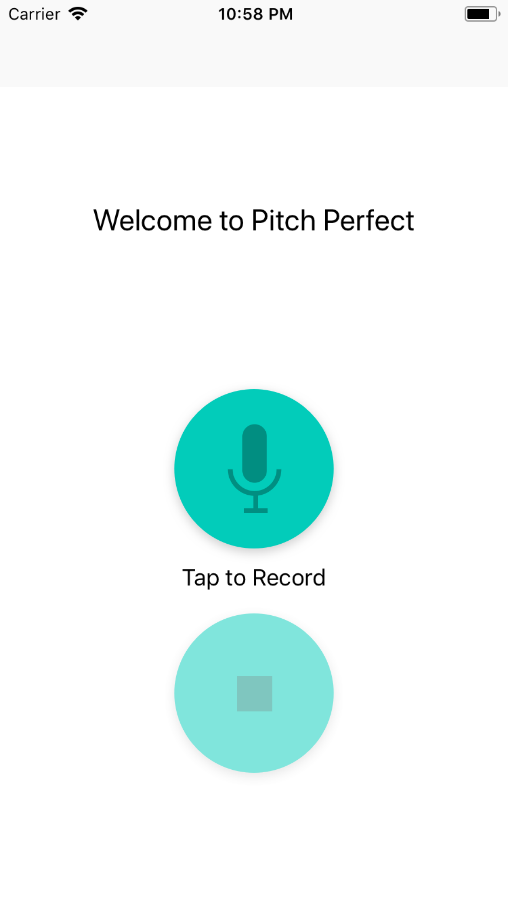
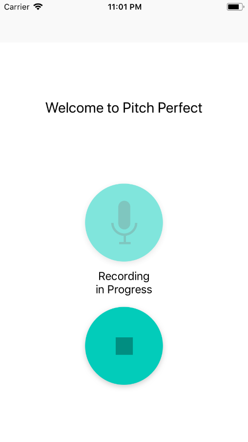
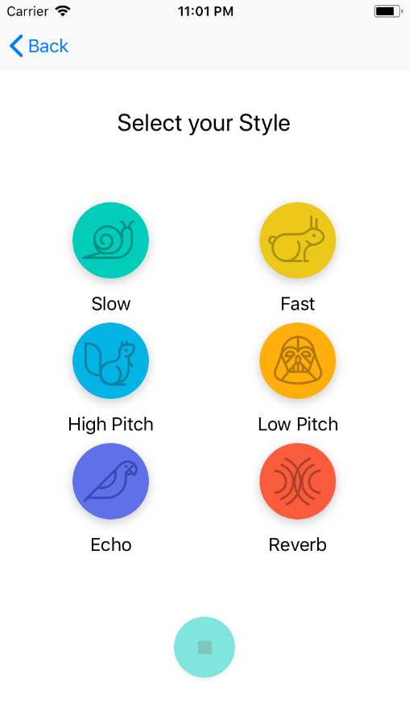

# Pitch Perfect (1/5)

This is the first of a five part series of sample apps created for [Udacity's Nanodegree "Become an iOS Developer"](https://udacity.com/course/ios-developer-nanodegree--nd003).

With Pitch Perfect you can record your own voice and then play it back with funny modifications. Amongst others 2x speed, 0.5x speed, dark pitched or high pitched.

The gist of the app had already been created (the recording and playing of voices) to be able to focus on the learning goal.
The learning goal of this app was to learn the basic handling of UIKit components. This includes:

* Navigation between scenes
* Adaptation of the user interface to fit different device sizes (like iPads and landscape orientation)

## Screenshots
  

## Getting Started

These instructions will get you a copy of the project up and running on your local machine for development and testing purposes.

### Prerequisites

What things you need to install the software and how to install them

```
You need an XCode version that is capable of supporting Swift4.0.
```

## Built With

_There were no external libraries used for this project._

## Authors

* **Niklas Rammerstorfer** - *Initial work* - [Shanakor](https://github.com/Shanakor)
